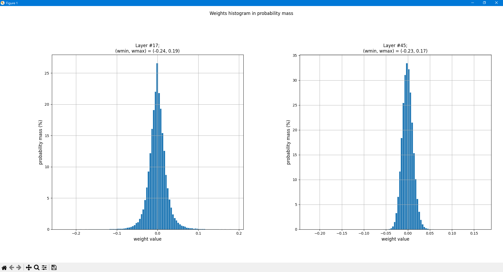
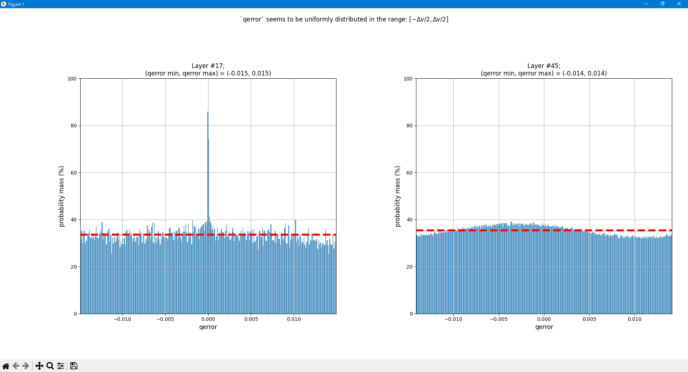
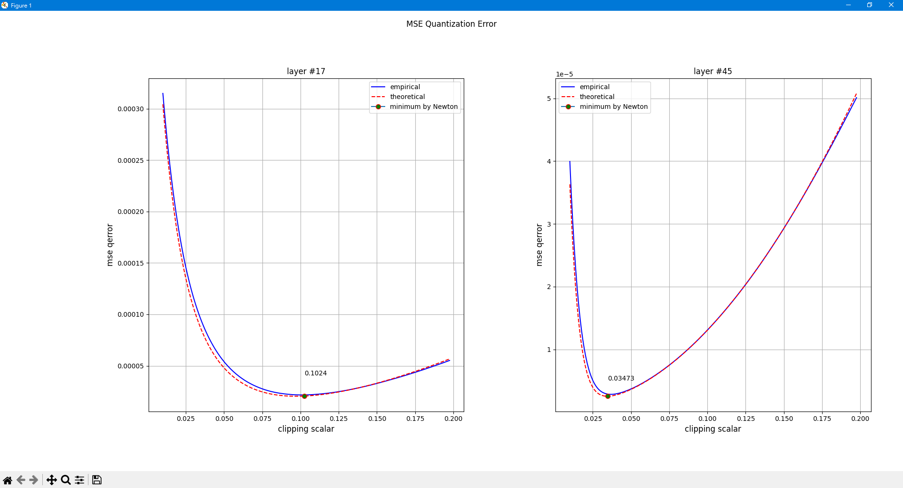

# OCTAV_toy_example
A toy example of [OCTAV](https://arxiv.org/abs/2206.06501) algorithm for finding the optimal clipping scalar in the quantization error problem.

Here, I'm trying to reproduce paper's (Optimal Clipping and Magnitude-aware Differentiation for Improved Quantization-aware Training [[arxiv](https://arxiv.org/abs/2206.06501)]) Figure 1 (a) with 4-bit case.

First of all, the fake quantization operator is defined as:
```math
Q(x;s) = \text{clip}(s\cdot2^{1-B}\cdot\text{round}(x\cdot2^{B-1}/s), -s, s)
```

We define $B$-bit quantization as the process of mapping $x$ to one of $2^B$ predefined levels. $s$ is the clipping scalar and we assume `zero_point` is $0$ in our case, i.e. symmetric quantization.

## Empirical Quantization Error
So the empirical `qerror` is defined as:
```math
J_{em}(s)=\mathbb{E}\left[(Q(X;s)-X)^2\right]
```
The main codes:
```python
def cal_qerror(w, qstepsize, zero, bit_num):
    quant_min, quant_max = -(2 ** (bit_num - 1)), 2 ** (bit_num - 1) - 1
    w_q = torch.fake_quantize_per_tensor_affine(torch.as_tensor(w), qstepsize, zero, quant_min, quant_max).numpy()
    return w - w_q

def do_empirical_qerror_scanning(w, qstepsize, zero, bit_num=4, scalar_num=200, plot_ratio=7.0):
    # `qstepsize` stands for quantization step size
    qerrors = []
    clipping_scalars = np.linspace(1e-2, qstepsize * plot_ratio, scalar_num)
    # for loop for each clipping scalar
    for cs in clipping_scalars:
        qerror = cal_qerror(w, 2 * cs / 2**bit_num, zero, bit_num)
        qerrors.append(np.mean(qerror**2))

    return qerrors, clipping_scalars
```

## Theoretical Quantization Error
The theoretical `qerror` in the paper:
```math
J_{th}(s)={4^{-B}\over3}s^2\int_0^s f_{|X|}(x)dx + \int_s^\infty (s-x)^2f_{|X|}(x)dx
```
We can use `np.histogram` to numerically calculate the equation, the main codes:
```python
def theoretical_mse_qerror(w, clipping_scalar, bit_num, bins=500):
    hist, bin_edges = np.histogram(np.abs(w), bins=bins, density=False)
    hist = hist / np.sum(hist)  # turn into probability mass (note that it is different with density)

    clip_start_idx = np.where(np.diff(bin_edges > clipping_scalar))[0]
    clip_start_idx = 0 if len(clip_start_idx) == 0 else clip_start_idx[0]

    J1 = np.sum(hist[:clip_start_idx]) * (clipping_scalar**2 / (3 * 4**bit_num))
    J2 = 0.0
    for idx in range(clip_start_idx, len(hist)):
        prob_x_mass = hist[idx]
        x = (bin_edges[idx + 1] + bin_edges[idx]) / 2
        J2 += (clipping_scalar - x) ** 2 * prob_x_mass

    return J1 + J2
```

## Finding Optimal Clipping Scalar
By Newton's method, the authors derived the update equation:
```math
s_{n+1}=\frac{\mathbb{E}\left[|X|\cdot\mathbf{1}_{\{|X|>s_n\}}\right]}
{{4^{-B}\over3}\mathbb{E}\left[\mathbf{1}_{\{|X|\leq s_n\}}\right] + \mathbb{E}\left[\mathbf{1}_{\{|X|>s_n\}}\right]}
```
The main codes:
```python
def find_opt_by_Newton_method(weights, bit_num, cs_init=0.0, iter_num=10):
    # `cs` stands for `clipping scalar`
    weights_abs = np.abs(weights)
    cs_cur = cs_init
    for itr in range(iter_num):
        indicator_larger = weights_abs > cs_cur
        indicator_smaller = weights_abs <= cs_cur  # should we ignore case with `==0`?
        numerator = np.sum(weights_abs[indicator_larger])
        denominator = np.sum(indicator_smaller) / (3 * 4**bit_num) + np.sum(indicator_larger)
        cs_cur = numerator / denominator
    return cs_cur
```

## How to run
Very simple, just execute the following command:
```
python qerror_analysis.py
```

## Results
We analyzed Resnet50 layer #17 and #45

- Weight histogram


- Quantization error histogram


- MSE of quantization error with empirical, theoretical erros and optimal clipping scalar


Looks good! 👏 Integrating OCTAV's Newton's update into torch's `observer` seems possible!

